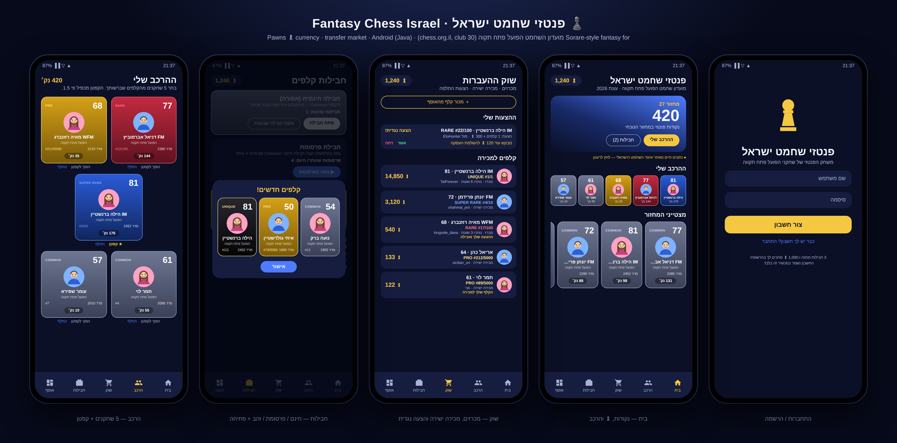

# פנטזי שחמט ישראל · Fantasy Chess Israel ♟️

A Sorare-inspired **fantasy game for Israeli chess players**, built around
**מועדון השחמט הפועל פתח תקוה** (the real club — id 30 on
[chess.org.il](https://www.chess.org.il/clubs/Club.aspx?Id=30), the Israeli
Chess Federation site) and its player database.

Collect player cards, build a squad of 5, trade on the transfer market with
the **Pawns (🨅)** currency, and earn fantasy points from the real games your
players play over the board every week.



## Features

- **Login** — the app opens with a login/registration screen. The account is
  local for now (password stored as a SHA-256 hash on-device); swap in real
  authentication when a backend exists.
- **Pawns (🨅)** — the in-game currency, a golden chess pawn. You start with
  1,000 and earn more by selling cards.
- **Card packs** — you can only field a player whose card you own:
  - **Free gray pack** — 3 Common cards. 3 packs on sign-up + 1 every game-week.
  - **Ad pack** — watch a rewarded ad (up to 5/day) for a free pack: Commons
    with a **15% chance per card of a Pro**. The ad is simulated; the hook for
    a real rewarded-ads SDK is one method in `PacksFragment`.
  - **Pro gold pack** — 600 🨅: Pro 70% · Rare 24% · Super Rare 5% · Unique 1%.
- **Scarcity ladder with per-season mint limits** (per player):

  | Tier | Color | Minted per season | Notes |
  |---|---|---|---|
  | Common | Gray | Unlimited | From free/ad packs. Play-only — **not tradable** |
  | Pro | Yellow | Up to 5,000 | Entry-level tokenized card, perfect for starting |
  | Rare | Red | Up to 100 | |
  | Super Rare | Blue | Up to 10 | |
  | Unique | Black | **Exactly 1** | The ultimate collectible |

  Serial numbers show scarcity (e.g. `#3/100`); when a tier sells out for a
  player, packs downgrade the card to the next tier.
- **Transfer market** — buy cards from other managers via **auctions**
  (bid, get outbid, win when the timer ends) or **direct sale** (buy now),
  and **sell** your own cards either way. On any listing you can also send a
  **trade offer**: a bundle of your cards and/or Pawns. The other manager
  accepts, rejects, or sends a **counter-offer** asking for extra Pawns,
  which you can accept or decline.
  *Until a game server exists, the other managers are simulated locally
  (`MarketSimulator`) with fair-value behavior; the API is designed so a real
  backend can replace the simulator without touching the UI.*
- **Squad of 5** — a 2-1-2 formation with a captain (×1.5 points).
- **1–100 card rating** derived from the player's **Israeli national rating
  (מדד)**: linear map, 1000 → 1 and 2800 → 100.
- **Weekly games** — every player page shows the games played during the
  current game-week (Sunday–Saturday) with fantasy points per game.
- **Avatars** — one shared picture for every boy and one for every girl.
- **Hebrew-first UI** with full RTL support (English translation included).

## Fantasy scoring

| Event | Points |
|---|---|
| Win | 60 |
| Draw | 30 |
| Loss (participation) | 10 |
| Opponent-strength adjustment (win) | ±(rating diff × 0.05), capped −15…+25 |
| Opponent-strength adjustment (draw) | ±(rating diff × 0.03), capped −10…+15 |
| Upset bonus (beat someone rated 150+ above you) | +20 |
| Unbeaten week (2+ games, no losses) | +10 |
| Captain | ×1.5 |
| Rarity bonus | Common +0% · Pro +5% · Rare +10% · Super Rare +20% · Unique +40% |

## Building & running

The app is written in **pure Java** with classic Android Views (no Kotlin).

1. Open the project in **Android Studio** (Hedgehog or newer).
2. Let Gradle sync (AGP 8.5.2, Gradle 8.7 wrapper, `compileSdk 34`, `minSdk 26`).
3. Run on any device/emulator with Android 8.0+.

Command line: `./gradlew assembleDebug` · Unit tests: `./gradlew test`
(scoring, rating-mapper, mint-ledger and pack tests).

## Israeli Chess Federation (chess.org.il) integration

All federation access lives in `app/src/main/java/.../data/api/`:

| File | Role |
|---|---|
| `IcfApiConfig.java` | **Every endpoint/URL in one place** — verified club id **30** and the `/clubs/Club.aspx?Id=…` / `/players/…` page patterns |
| `IcfApiClient.java` | OkHttp client: tries JSON endpoints first, then falls back to HTML |
| `IcfHtmlParser.java` | Jsoup parser for the classic player-card (כרטיס שחקן) and club pages |

The app loads data in this order, so it **always runs smoothly**:

1. **Live JSON API** on chess.org.il;
2. **HTML scraping** of the classic federation pages — the club page URL for
   Hapoel Petah Tikva (`Id=30`) is verified real;
3. **Bundled sample roster** (`assets/hapoel_pt_players.json`) — used offline
   or whenever the site is unreachable. The home screen shows an honest
   "demo mode" banner whenever sample data is displayed; tapping retries.

> **Why the fallback names are placeholders:** chess.org.il blocks
> server-side fetchers (Cloudflare), and this project was developed in a
> sandbox whose network policy blocks the site entirely, so the club's real
> member list could not be pulled here. **On a phone the app fetches the real
> roster live from club page Id=30.** If you want real names in the offline
> fallback too, open the club page in a browser and paste the players into
> the JSON asset — the format is self-explanatory.

## Architecture

```
app/src/main/java/com/fantasychess/israel/
├── LoginActivity                 local account gate (register/sign-in)
├── data/
│   ├── api/        IcfApiConfig · IcfApiClient · IcfHtmlParser
│   ├── local/      LocalStore (SharedPreferences + Gson persistence)
│   ├── model/      Player · WeekGame · OwnedCard · Squad · Rarity ·
│   │               MarketListing · TradeOffer · UserProfile
│   ├── repo/       FantasyRepository (single source of truth, LiveData)
│   └── sample/     SampleDataSource · SampleWeekGenerator (Elo-based demo games)
├── domain/         RatingMapper · FantasyScoring · PackGenerator · GameWeek ·
│                   MintLedger (season caps) · CardValuator · MarketSimulator
└── ui/
    ├── MainViewModel · PlayerCardBinder
    ├── adapters/   CardGridAdapter (click/single/multi-select) ·
    │               LeadersAdapter · MarketAdapter · OffersAdapter
    └── fragments/  Home · Squad · Market · Packs · Collection · PlayerDetail
```

- **MVVM**: `FantasyRepository` owns an immutable `State` snapshot published
  through LiveData; all mutations run on a single background executor, so the
  UI thread never blocks (smooth scrolling, no jank).
- Networking never throws into the UI — every failure falls back one level.
- Persistence is plain SharedPreferences + Gson (no annotation processors).

---

### עברית — בקצרה

משחק פנטזי לשחקני **מועדון השחמט הפועל פתח תקוה**: נרשמים, פותחים חבילות
(אפורה חינם, פרסומת עם סיכוי ל-Pro, וזהב ב-🨅), מרכיבים סגל של 5 עם קפטן,
וסוחרים בשוק ההעברות — מכרזים, מכירה ישירה והצעות החלפה עם הצעות נגדיות.
דירוג כל קלף (1–100) נגזר מהמדד באתר איגוד השחמט, ובעמוד כל שחקן מוצגים
משחקי השבוע. סולם הנדירות: Common אפור (ללא הגבלה) · Pro צהוב (5,000 לעונה)
· Rare אדום (100) · Super Rare כחול (10) · Unique שחור (אחד בלבד לעונה).
